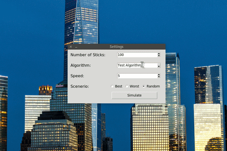

# Sorting Simulation

The Sorting Simulation is a basic simulation software which you can simulate a few sorting algorithms. You can set sorting algorithm, speed and number of sticks. 

Every stick represents a number; then the software begins to sort them with algorithm which you select before. At the end, you can check comparison number and elapsed time. So you can consolidate your knows. 

## Dependencies

This software needs:

- Python3.x
- PyGame v1.9.x
- Tkinter

